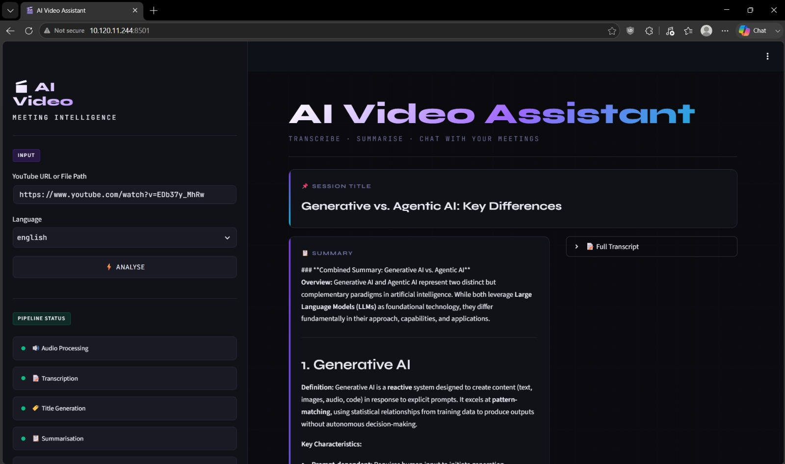
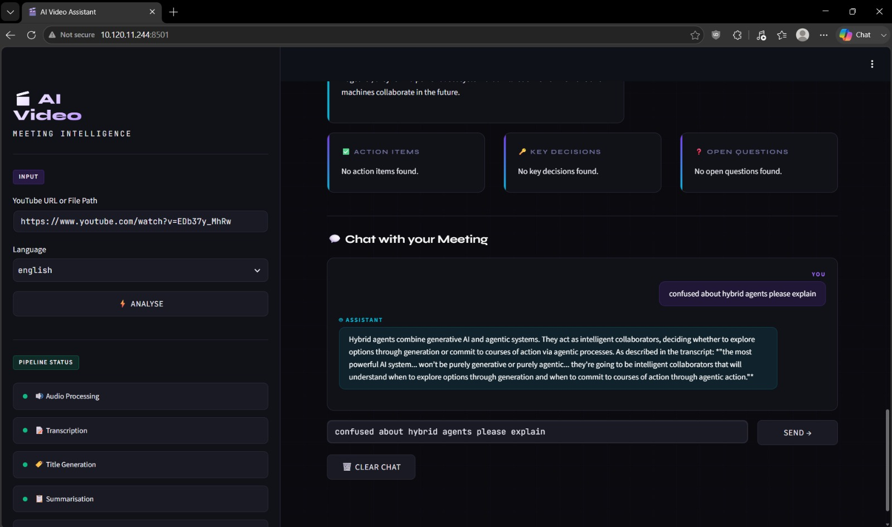

<div align="center">

# 🎥 AI Video Assistant

### AI-powered Video Understanding using Retrieval-Augmented Generation (RAG)

Analyze videos with AI by generating transcripts, summaries, key insights, and context-aware answers through natural language conversation.


</div>

---

# 📖 Overview

AI Video Assistant is an end-to-end **Retrieval-Augmented Generation (RAG)** application that enables users to analyze video content using AI.

The application extracts audio from uploaded videos, transcribes speech using **OpenAI Whisper**, converts the transcript into semantic embeddings using **HuggingFace Sentence Transformers**, stores them in **ChromaDB**, and answers user questions using **LangChain** with the **Mistral Large Language Model** via the **Groq API**.

Along with conversational question answering, the application automatically generates structured insights from the uploaded video, including:

- 📝 AI-generated title
- 📄 Video summary
- 📌 Key decisions (when applicable)
- ✅ Action items (when applicable)
- ❓ Open questions (when applicable)

The application can be used to understand lectures, presentations, interviews, meetings, tutorials, podcasts, and other spoken-content videos.

---

# ✨ Features

- 📁 Upload video files
- 🎙 Speech-to-text transcription using OpenAI Whisper
- 📜 Complete transcript generation
- 📝 AI-generated video title
- 📄 AI-generated video summary
- 📌 Key decision extraction
- ✅ Action item extraction
- ❓ Open question extraction
- 💬 Ask questions about the uploaded video
- 🧠 Retrieval-Augmented Generation (RAG)
- ⚡ Interactive Streamlit interface

---

# 🛠 Tech Stack

| Category | Technology |
|-----------|------------|
| Programming Language | Python |
| Frontend | Streamlit |
| Speech Recognition | OpenAI Whisper |
| LLM | Mistral (Groq API) |
| Framework | LangChain |
| Embeddings | HuggingFace Sentence Transformers |
| Vector Database | ChromaDB |
| Audio Processing | FFmpeg |

---

# 🏗 System Workflow

```text
                 Upload Video
                      │
                      ▼
          Audio Extraction (FFmpeg)
                      │
                      ▼
         Whisper Speech Transcription
                      │
                      ▼
           Transcript Generation
                      │
                      ▼
    HuggingFace Embedding Generation
                      │
                      ▼
             ChromaDB Vector Store
                      ▲
                      │
              User Question
                      │
                      ▼
           LangChain Retriever
                      │
                      ▼
        Mistral LLM (via Groq API)
                      │
                      ▼
             AI Generated Response
```

---

# 📂 Project Structure

```text
AI-Video-Assistant/

├── app.py
├── main.py
├── requirements.txt
├── README.md
│
├── core/
│   ├── rag_engine.py
│   ├── vector_store.py
│   └── ...
│
├── .streamlit/
│   └── config.toml
│
├── assets/
│   ├── homepage.jpg
│   └── chat-interface.jpg
│
└── .gitignore
```

> Update the project structure if you have additional folders or files.

---

# 🚀 Installation

Clone the repository

```bash
git clone https://github.com/YOUR_GITHUB_USERNAME/AI-Video-Assistant.git
```

Move into the project directory

```bash
cd AI-Video-Assistant
```

Create a virtual environment

```bash
python -m venv venv
```

Activate the environment

### Windows

```bash
venv\Scripts\activate
```

Install the required dependencies

```bash
pip install -r requirements.txt
```

---

# 🔑 Environment Variables

Create a `.env` file in the project root.

```env
GROQ_API_KEY=YOUR_GROQ_API_KEY
HF_TOKEN=YOUR_HUGGINGFACE_TOKEN
```

---

# ▶️ Running the Application

Start the Streamlit application

```bash
streamlit run app.py
```

If the browser does not automatically launch on some Windows systems:

```bash
streamlit run app.py --server.headless true
```

Then manually open

```
http://127.0.0.1:8501
```

---

# 📸 Application Preview

## Home Page



---

## AI Chat Interface



---

# 💬 Example Questions

```text
Summarize this video.

What are the main topics discussed?

Explain the concept of hybrid agents.

List the key points covered in the video.

What decisions were made?

What action items were identified?

What open questions remain?
```

---

# 🔄 Application Pipeline

1. Upload a video.
2. Audio is extracted from the uploaded video.
3. Whisper transcribes the speech into text.
4. The transcript is converted into semantic embeddings.
5. Embeddings are stored in ChromaDB.
6. LangChain retrieves the most relevant transcript chunks.
7. The Mistral LLM generates context-aware responses.
8. The application displays AI-generated insights and enables interactive question answering.

---

# ⚠️ Troubleshooting

If Streamlit does not automatically open the browser on Windows, run:

```bash
streamlit run app.py --server.headless true
```

The included `.streamlit/config.toml` contains compatibility settings that help resolve browser launch issues on some Windows environments.

---

# 🚀 Future Improvements

- Support for additional video formats
- Improved transcript chunking strategies
- Additional embedding models
- Support for multiple LLM providers
- Enhanced user interface

---

# 🤝 Contributing

Contributions are welcome!

If you'd like to improve this project, feel free to fork the repository, open an issue, or submit a pull request.

---

<div align="center">

### ⭐ If you found this project useful, consider giving it a star!

</div>
